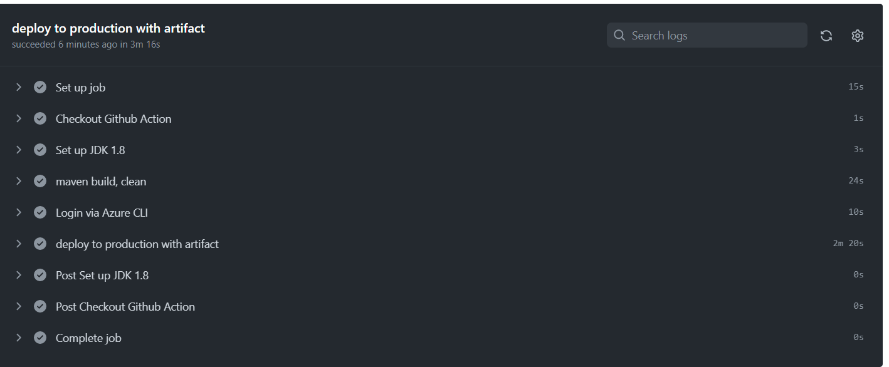

````code
from pyspark.sql.functions import date_format, current_timestamp

  # Get current timestamp
  current_time = date_format(current_timestamp(), "yyyyMMdd_HHmmss")

  # Define folder and file names
  base_path = "abfss://container@storageaccount.dfs.core.windows.net/unified_files"
  source_name = "bc_com"
  record_type = "party"
  folder_path = f"{base_path}/source={source_name}/year=2023/month=10/day=25/type={record_type}"
  file_name = f"unified_file_{current_time}.parquet"

  # Save unified file
  unified_df.write.format("parquet").mode("overwrite").save(f"{folder_path}/{file_name}")


```


# Spring Boot Microservices with Eureka Discovery Server and Spring Cloud Gateway(Banking service)

This repository contains a sample project demonstrating the use of  Spring Boot, Eureka Discovery Server, and Spring Cloud Gateway for building microservices architecture.

### Banking services for current account opening and make transactions

This project provides banking services for current account opening and transactions. It allows customers to open a current account, view account information, and perform various transactions such as deposits, withdrawals.

## Prerequisites

* Java 8 or higher
* Node.js and npm
* Angular CLI
* Maven
* git

## Technologies used

* Spring Boot 2.x
* Spring Cloud Netflix Eureka
* Spring Cloud Gateway
* resilience4j circuit breaker
* lombok
* mapstruct
* liquibase
* H2 in memory DB
* Swagger

## Project Structure

The project consists of three microservices:

* eureka-discovery-service - Eureka Discovery Server
* api-gateway - Spring Cloud Gateway
* account-service - account microservice
* transaction-service - transaction microservice
* front-end-app - angular front-end application

## Getting Started

1. Clone the repository to your local machine.

```bash
git clone https://github.com/ajitkumargiri/banking-services.git

```

2. Start the Eureka Discovery Server.

```bash
cd eureka-discovery-service
mvn spring-boot:run

```

The application will be running on `http://localhost:8761`.

4. Start the api-gateway.

```bash
cd api-gateway
mvn spring-boot:run

```

The application will be running on `http://localhost:8765`.

4 . Start the account-service.

```bash
cd account-service
mvn spring-boot:run
```

The application will be running on `http://localhost:8001`.

5. Start transaction-service

```bash
cd transaction-service
mvn spring-boot:run
```

The application will be running on `http://localhost:8002`.

7. Start front-end

```bash
cd front-end-app
npm install
ng serve

```

The front end application will be running on `http://localhost:4200`.

Now all the applications are runing.

## API Documentation

The API documentation is available in Swagger.

`http://localhost:8001/swagger-ui/index.html`  - account-service

`http://localhost:8002/swagger-ui/index.html` - transaction-service


### CICD with github action.

Deployed microservice to azure spring app using github action.



